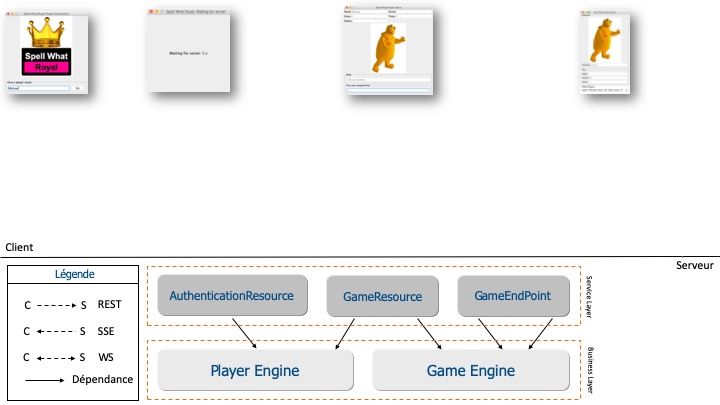

# Exercice 1 : identifier les technologies de communication HTTP

Ce premier exercice propose de choisir les solutions technologiques et les données manipulées pour réaliser les communications entre les interfaces graphiques du client et le serveur. Trois technologies sont proposées :

* service web REST ;
* SSE (Server-Sent Event) pour une communication unidirectionnelle du serveur vers le client ;
* WebSocket pour une communication bidirectionnelle client/serveur.

Vous allez donc choisir pour les quatre interfaces graphiques une ou plusieurs solutions technologiques (REST, SSE ou WS). Vous aurez également à définir les données qui seront à retourner au serveur et la structure des données que le serveur retournera au client.

Cette phase de conception est très importante pour la suite des exercices car elle figera et justifiera les choix technologiques qui seront implémentés par des bibliothèques Java.

La figure ci-dessous est un schéma que vous pouvez utiliser pour répondre aux différentes questions de cet exercice. Ce [lien](./files/streaminghttp-tutorial-schema.pdf) retourne une version imprimable au format PDF.

## But

* Choisir la technologie de communication adéquate (REST ou Streaming HTTP) en fonction d'un besoin exprimé.
* Identifier les données à envoyer et recevoir.

## Étapes à suivre

La première interface graphique correspond à l'écran d'identification du joueur. L'utilisateur doit saisir un nom pour que le serveur puisse lui retourner un _Token_. Ce _Token_ servira par la suite à identifier le joueur à chaque interaction avec le serveur. Quand le _Token_ est reçu par le client, l'interface graphique est fermée. Le joueur est autorisé à jouer.

* **Question 1** : identifier la technologie de communication adéquate pour l'écran d'identification du joueur en précisant les structures de données qui peuvent être envoyées et reçues par le serveur et le client.

> **Note 1** : le serveur est responsable de l'état de l'application. Trois états sont disponibles : `PRE_GAME`, `IN_GAME` et `POST_GAME`. En fonction de cet état, le client affiche l'interface graphique adaptée : interface graphique de mise en attente quand l'état est `PRE_GAME`; interface graphique d'une manche pour l'identification d'une image quand l'état est `IN_GAME` et interface graphique du résultat d'une manche et des scores de tous les joueurs quand l'état est `POST_GAME`.

> **Note 2** : un joueur peut se connecter à tout moment. Il est donc important de pouvoir retourner les informations à chaque instant.

La deuxième interface graphique correspond à l'écran de mise en attente qui s'affiche après chaque manche. Elle affiche un compteur qui décroit. Quand le compteur atteint la valeur 0, l'écran se ferme pour démarrer une manche du jeu.

* **Question 2** : identifier la technologie de communication adéquate pour l'écran de mise en attente du joueur en précisant les structures de données qui peuvent être envoyées et reçues par le serveur et le client.

La troisième interface graphique correspond à l'écran du jeu. La proposition du joueur (qui est la seule interaction possible de l'utilisateur) est donnée dans le champ _Give your proposition_. Une indication pour faciliter la recherche du texte est donnée dans le champ _Help_. Plusieurs autres informations sont renseignées pour donner l'état actuel de la partie à savoir :

* le nom du joueur dans le champ _Name_ ;
* le score du joueur dans le champ _Score_ ;
* le champ _Found_ pour avertir le joueur d'une bonne ou mauvaise réponse (dynamique à chaque saisie de l'utilisateur) ;
* le champ _Others_ pour indiquer le nombre de joueur ayant trouvé la bonne réponse (exemple : 4/10) ;
* le champ _Timer_ pour retourner la valeur du chronomètre.

Quand l'utilisateur saisit un texte, le serveur est alors notifié d'une proposition d'un joueur. Il informe ce joueur s'il a donné une bonne réponse. Il informe également tous les autres joueurs en mettant à jour le nombre de joueur ayant trouvé la bonne réponse. Quand le compteur atteint la valeur 0, l'écran se ferme pour afficher les résultats.

* **Question 3** : identifier les technologies de communication adéquate pour l'écran du jeu en précisant pour chacune les structures de données qui peuvent être envoyées et reçues par le serveur et le client.

La dernière interface graphique correspond au résultat d'une manche et des scores de tous les joueurs. L'image est visible ainsi que le texte à deviner (champ _solution_).

* Pour le joueur courant (zone _You_), il est rappelé la valeur qu'il a donnée (champ _value_). Il est aussi indiqué si le joueur a trouvé (champ _Found_) et son score actuel (champ _Score_).
* Pour tous les joueurs (zone _Other Players_), il est listé le nom, la valeur proposée et le score.

Il n'y a aucune interaction possible de l'utilisateur sur cette interface graphique. Quand le compteur atteint la valeur 0, l'écran se ferme pour afficher l'écran de mise en attente de la prochaine manche.

* **Question 4** : identifier la technologie de communication adéquate pour l'écran d'affichage des résultats en précisant pour chacune les structures de données qui peuvent être envoyées et reçues par le serveur et le client.
